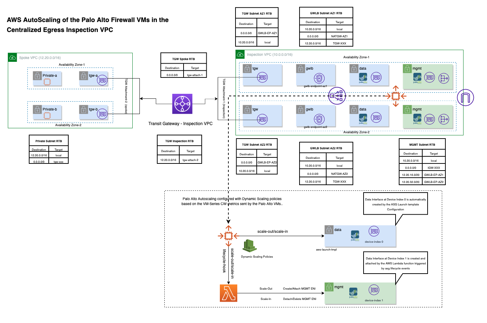

# AWS AutoScaling of the Palo Alto Firewall VMs in the Centralized Egress Inpsection VPC

# Overview

The terraform code in this pattern provisions an Egress Inspection VPC in AWS using the Gateway Load Balancer and the Autoscaling of the VM-Series Palo Alto Firewall instances. 

The Autoscaling group is configured with dynamic scaling policies using the CloudWatch metrics sent by the Palo Alto VMs.

Two dynamic scaling policies 1.panSessionUtilization and 2. DataPlaneCPUUtilizationPct are configured on ASG. ASG actively monitors these alarms and scale-out and scale based on the thresholds defined in the configuration. 

During a scale-out event, ASG launches an instance using the AWS launch template configuration with a data network interface (data-eni) on device index 0.

A lifecycle hook (“launch“) triggers the Lambda function that creates and attaches a management network interface (mgmt-eni) on device index 1 on the Palo Alto EC2 instance. 

The Palo Alto VM bootstraps using the configuration provided in the UserData from the AWS launch template configuration.

During a scale-in event, the ASG lifecycle hook (“terminate“) triggers the lambda function that will detach and delete the management interface and send complete lifecycle action back to the ASG to remove the instances from the group successfully.

The terraform code also provisions a spoke vpc, tgw attachments, and required route tables to route all of the egress traffic from the ec2 instance in the private subnet of the spoke vpc to the internet through inspection VPC Palo Alto firewalls.

To make the process easier, the code also deploys SSM endpoints to connect to the ec2 instance in the spoke vpc using SSM.

`Note: The purpose of this post is to demonstrate the AWS Autoscaling of the Palo Alto VM-Series firewalls with Dynamic Scaling Policies in the egress inspection vpc. Users should refer to the Palo Alto documentation while configuring resources per their recommendations and best practices.`


# Architecture



## Pre Requisites

1. Generate a key pair and provide the key name in the terraform.tfvars file on the key_name variable. 

## Deployment Steps

1. terraform init
2. terraform apply

## Post Deployment Steps (Mandatory):

`Note: Wait atleast 20-25 mins for the Palo Alto VM to bootstrap. Assign an elastic IP on to the instance Management Network Interface to access the Palo Alto VM via browser and ssh using the key name.`


#### 1. Assign admin user password to access the Palo Alto VM via web browser.

```
ssh -i <KEY_NAME>.pem  admin@xxx

admin@vmseries-fw1-poc> configure
Entering configuration mode
[edit]                                                                                                                                                                                                                                       
admin@vmseries-fw1-poc# set mgt-config users admin password
Enter password   : 
Confirm password : 

[edit]                                                                                                                                                                                                                                       
admin@vmseries-fw1-poc# commit

Commit job 3 is in progress. Use Ctrl+C to return to command prompt
..............55%.98%................100%
Configuration committed successfully

[edit]                                                                                                                                                                                                                                       
admin@vmseries-fw1-poc# exit
Exiting configuration mode
admin@vmseries-fw1-poc> exit
Connection to xxx closed.

```

#### 2. Configure a Management allowing “https” and Security Profile 

Follow `Step-6` and `Step-7` from the below article to Configure a Management profile allowing “https” for GWLB target Group health checks to pass.

 https://docs.paloaltonetworks.com/vm-series/10-1/vm-series-deployment/set-up-the-vm-series-firewall-on-aws/vm-series-integration-with-gateway-load-balancer/integrate-the-vm-series-with-an-aws-gateway-load-balancer/manually-integrate-the-vm-series-with-a-gateway-load-balancer.  


Commit changes and you should see the GWLB target group health check pass and tra

#### 3. Enable CloudWatch Metrics 

Follow the `Step-2` to enable cloud watch metrics on the Palo Alto VMs.

https://docs.paloaltonetworks.com/vm-series/9-1/vm-series-deployment/set-up-the-vm-series-firewall-on-aws/deploy-the-vm-series-firewall-on-aws/enable-cloudwatch-monitoring-on-the-vm-series-firewall

Commit changes in the Firewalls, and a custom namespace will be created with the Palo Alto VM metrics like below:


## Validate

After successfull deployment, completing the pre requisites, post deployment steps and making sure the GWLB target group health checks are passing, login to the AWS console and connect the spoke-vm via SSM manager and execute curl "https://google.com", and you should see the traffic is routed to the Palo Alto instances. 


