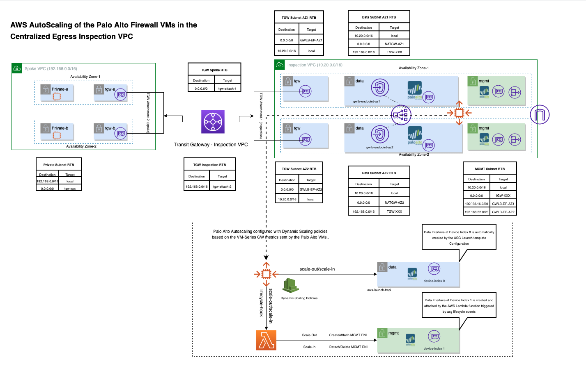
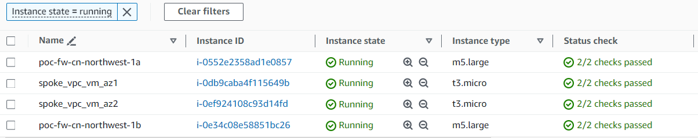
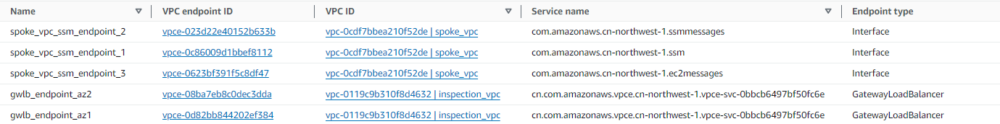
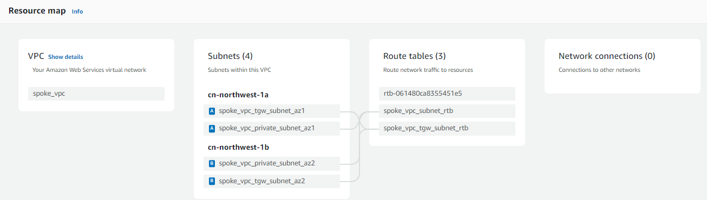
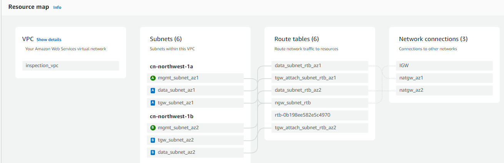
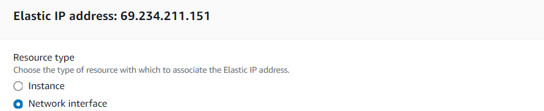
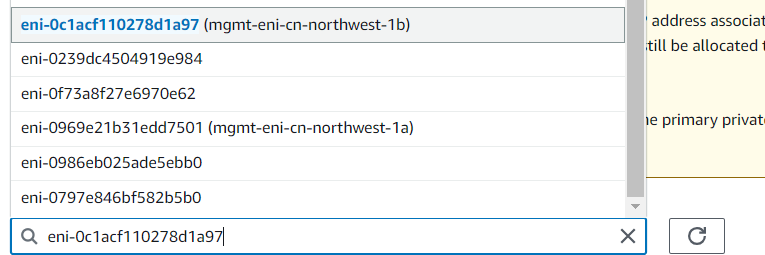
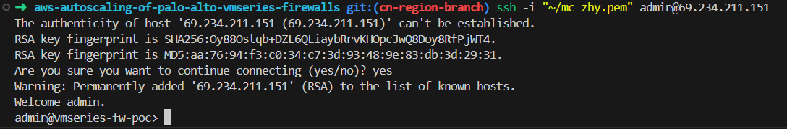
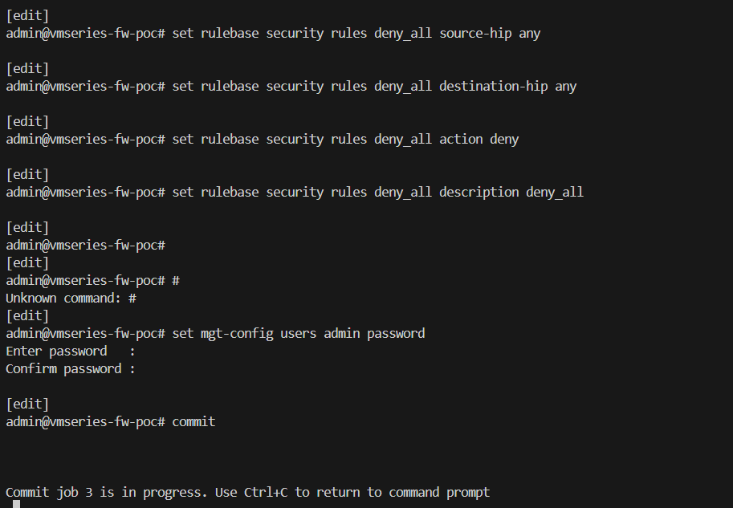
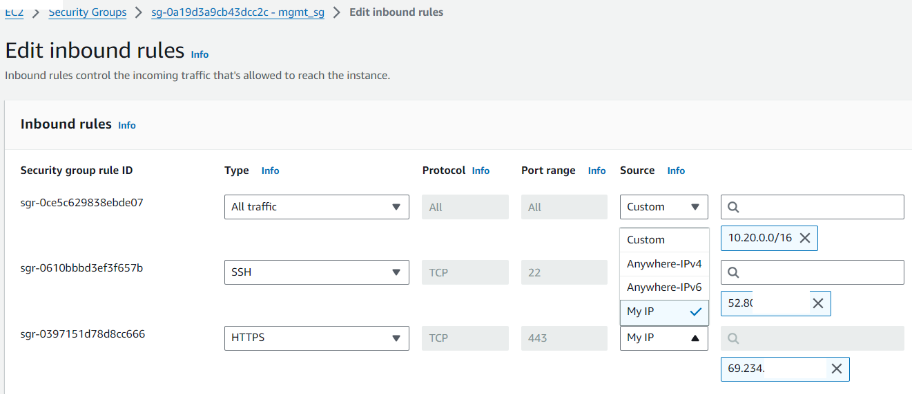

# Ludus ELB 动手实验
## 基于 Amazon GWLB 实现可扩展防火墙集群
# Declariation
This is a fork version of aws-samples/aws-autoscaling-of-palo-alto-vmseries-firewalls for demo and lab properse 
https://github.com/aws-samples/aws-autoscaling-of-palo-alto-vmseries-firewalls

The main differences:
1. adopt arn for China region
2. replace spoken VM AMI with AL2023 in China
3. add Palo Alto init configuration script
4. this Branch is designated for China Ludus Program for lab using
   
# 前言
在本实验中，您将学习以下内容：
1.	使用GWLB构建中心化的Inspection VPC
2.	通过TGW将流量传递到Inspection VPC检查以后再发往目的地
3.	通过实验，手工添加路由表，熟悉GWLB方案中路由表的构建
4.	如果使用Terraform快速部署防火墙实例，VPC, TGW， GWLB以及其他相关资源
5.  本实验将不涉及ASG扩缩容部分

# 架构图



# 实验初始化步骤
1. 使用邮件中附带的key和IP地址登录到EC2上
2. 进入实验文件夹`ludus-elb-GWLB-lab`
3. 使用`aws s3 ls`检查权限是否有效
4. `terraform init` 初始化terraform 配置
5. `terraform apply` 开始部署基础资源（VPC, EC2, route table...) 
6. 使用邮件中附带的user登录控制台检查资源

* EC列表

* Endpoints列表 

* Spoke_vpc

* Inspection_vpc


7. 创建2个EIP并且和防火墙的MGMT端口（mgmt-eni-xxx）关联
* EIP关联类型选择Network Interface

* 分别关联两个防火墙


8. 等poc-fw两个实例创建完成，使用key登录SSH 登录到Palo Alto的实例: 
   `ssh -i “<key.pem>” admin@<EIP>`
   

9. 复制scripts/init_configuration的内容到CLI里（第一遍会有报错，可以粘贴2次），用于**输入新管理员密码**并且初始化配置，然后输入commit并回车。 
   

10. 修改mgmt_sg允许操作者电脑的Public IP通过https访问
   在mgmt_sg里添加一条inbound rule， type=HTTPS, source=MY IP
       

11. 现在所有的资源都创建成功了，实验者也可以通过网页访问2台防火墙的https://<EIP>, 并且使用刚刚修改的管理员密码登录
    

# GWLB路由添加
Terrafrom的运行环境中只建立了路由表而没有路由，因此我们需要初步添加路由，将全链路打通
步骤：
1. From Spoke VPC to anywhere
2. From TGW to anywhere
3. From TGW to Spoke VPC
4. From TGW subnet to anywhere via GWLB(two AZs)
5. For Data going to Internet via NATGW(two AZs)
6. For Data coming from Internet to Spoke VPC via NATGW(two AZs)
7. For Data comming from Internet to Spoke VPC Via GWLBe1
8. For Data comming from Internet to Spoke VPC Via GWLBe2
   
# Troubleshooting 
## 没有订阅
如果没有订阅Palo Alto Market Place AMI, Terraform 会报如下错误. 可以请实验讲师检查订阅PAN-OS 11.0.2。

```
│ Error: creating Auto Scaling Group (myasg): ValidationError: You must use a valid fully-formed launch template. In order to use this AWS Marketplace product you need to accept terms and subscribe. To do so please visit https://aws.amazon.com/marketplace/pp?sku=xxx
│ 	status code: 400, request id: 467395b0-325d-4127-a42b-8351cc7b8bce
│ 
│   with module.ec2_vpc.aws_autoscaling_group.myasg,
│   on modules/aws_ec2_vpc/asg.tf line 59, in resource "aws_autoscaling_group" "myasg":
│   59: resource "aws_autoscaling_group" "myasg" {
```